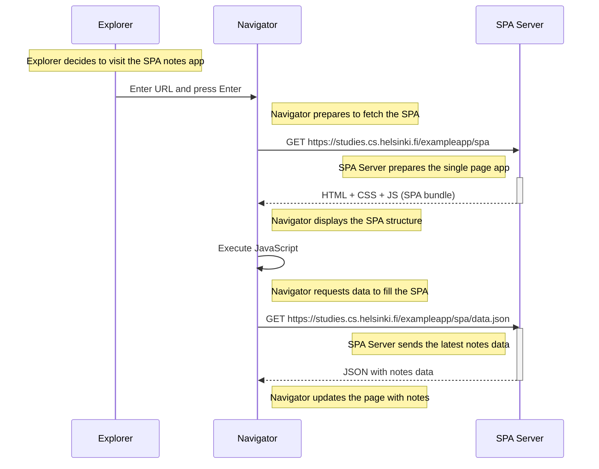

```mermaid
sequenceDiagram
    participant User as Explorer
    participant Browser as Navigator
    participant Server as SPA Server

    Note over User: Explorer decides to visit the SPA notes app
    User->>Browser: Enter URL and press Enter
    Note right of Browser: Navigator prepares to fetch the SPA

    Browser->>Server: GET https://studies.cs.helsinki.fi/exampleapp/spa
    Note left of Server: SPA Server prepares the single page app
    activate Server
    Server-->>Browser: HTML + CSS + JS (SPA bundle)
    deactivate Server

    Note right of Browser: Navigator displays the SPA structure
    Browser->>Browser: Execute JavaScript
    Note right of Browser: Navigator requests data to fill the SPA

    Browser->>Server: GET https://studies.cs.helsinki.fi/exampleapp/spa/data.json
    activate Server
    Note left of Server: SPA Server sends the latest notes data
    Server-->>Browser: JSON with notes data
    deactivate Server

    Note right of Browser: Navigator updates the page with notes
```
