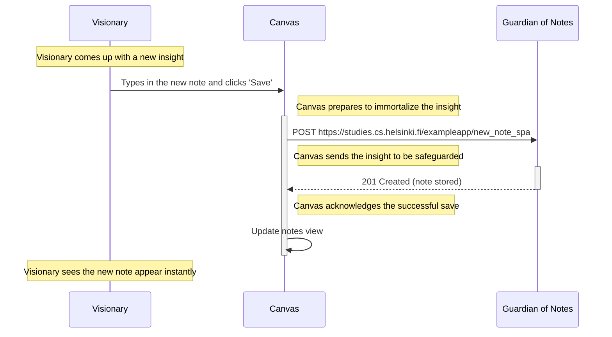

```mermaid
sequenceDiagram
    participant User as Visionary
    participant Browser as Canvas
    participant Server as Guardian of Notes

    Note over User: Visionary comes up with a new insight
    User->>Browser: Types in the new note and clicks 'Save'
    Note right of Browser: Canvas prepares to immortalize the insight

    activate Browser
    Browser->>Server: POST https://studies.cs.helsinki.fi/exampleapp/new_note_spa
    Note right of Browser: Canvas sends the insight to be safeguarded
    activate Server
    Server-->>Browser: 201 Created (note stored)
    deactivate Server

    Note right of Browser: Canvas acknowledges the successful save
    Browser->>Browser: Update notes view
    deactivate Browser

    Note over User: Visionary sees the new note appear instantly
```
