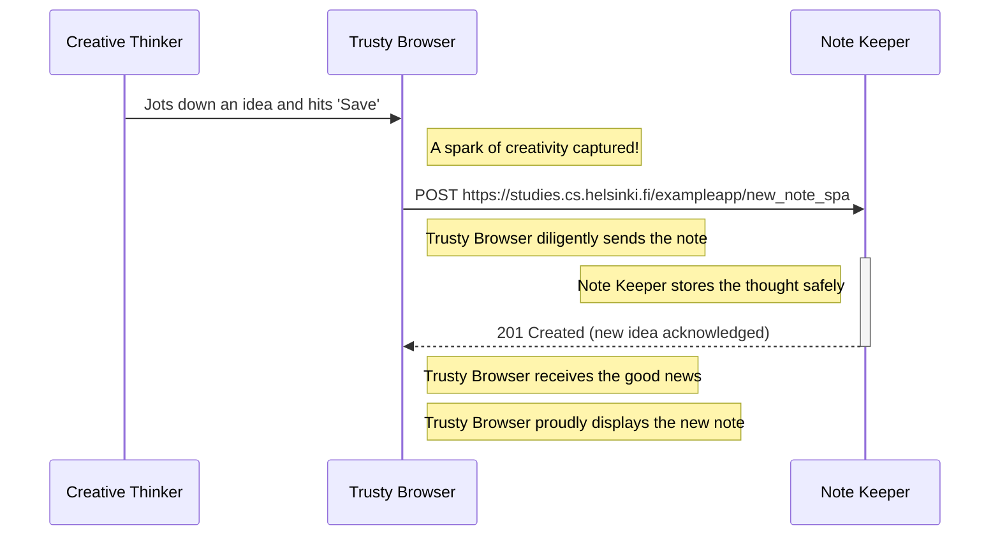

```mermaid
sequenceDiagram
    participant User as Creative Thinker
    participant Browser as Trusty Browser
    participant Server as Note Keeper

    User->>Browser: Jots down an idea and hits 'Save'
    Note right of Browser: A spark of creativity captured!

    Browser->>Server: POST https://studies.cs.helsinki.fi/exampleapp/new_note_spa
    Note right of Browser: Trusty Browser diligently sends the note

    activate Server
    Note left of Server: Note Keeper stores the thought safely
    Server-->>Browser: 201 Created (new idea acknowledged)
    deactivate Server

    Note right of Browser: Trusty Browser receives the good news
    Note right of Browser: Trusty Browser proudly displays the new note
```
